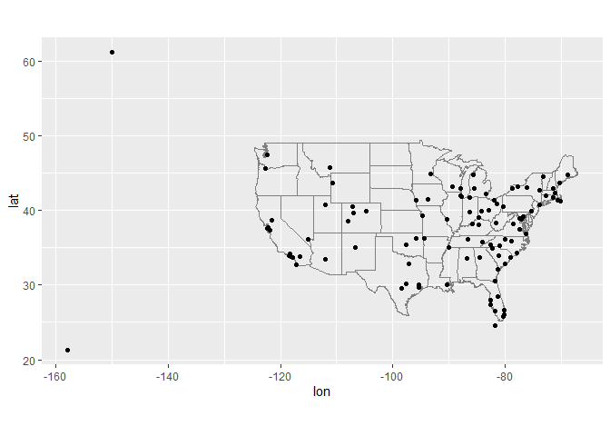

# Lab 7 - Hannah Pryor


<br>

Load packages and data

``` r
# Load required packages
library(tidyverse)
library(knitr)
library(nycflights13)

flights |> head() |> kable()
```

| year | month | day | dep_time | sched_dep_time | dep_delay | arr_time | sched_arr_time | arr_delay | carrier | flight | tailnum | origin | dest | air_time | distance | hour | minute | time_hour |
|---:|---:|---:|---:|---:|---:|---:|---:|---:|:---|---:|:---|:---|:---|---:|---:|---:|---:|:---|
| 2013 | 1 | 1 | 517 | 515 | 2 | 830 | 819 | 11 | UA | 1545 | N14228 | EWR | IAH | 227 | 1400 | 5 | 15 | 2013-01-01 05:00:00 |
| 2013 | 1 | 1 | 533 | 529 | 4 | 850 | 830 | 20 | UA | 1714 | N24211 | LGA | IAH | 227 | 1416 | 5 | 29 | 2013-01-01 05:00:00 |
| 2013 | 1 | 1 | 542 | 540 | 2 | 923 | 850 | 33 | AA | 1141 | N619AA | JFK | MIA | 160 | 1089 | 5 | 40 | 2013-01-01 05:00:00 |
| 2013 | 1 | 1 | 544 | 545 | -1 | 1004 | 1022 | -18 | B6 | 725 | N804JB | JFK | BQN | 183 | 1576 | 5 | 45 | 2013-01-01 05:00:00 |
| 2013 | 1 | 1 | 554 | 600 | -6 | 812 | 837 | -25 | DL | 461 | N668DN | LGA | ATL | 116 | 762 | 6 | 0 | 2013-01-01 06:00:00 |
| 2013 | 1 | 1 | 554 | 558 | -4 | 740 | 728 | 12 | UA | 1696 | N39463 | EWR | ORD | 150 | 719 | 5 | 58 | 2013-01-01 05:00:00 |

<br>

Question 1: Compute the average delay by destination, then join on the
`airports` data frame so you can show the spatial distribution of
delays. Here’s an easy way to draw a map of the United States:

``` r
library(maps) #install.packages("maps")

airports |>
  semi_join(flights, c("faa" = "dest")) |>
  ggplot(aes(lon, lat)) +
    borders("state") +
    geom_point() +
    coord_quickmap()
```



<br>

Use the `size` or `colour` of the points to display the average delay
for each airport

``` r
# add a column with average delay to the flights dataframe and pull out onlu the required columns, also rename dest to faa to make merging easier
flight_delays <- flights |> 
  group_by(dest) |> 
  mutate(avg_delay=mean(arr_delay, na.rm=T)) |> 
  select(dest, arr_delay, avg_delay) |> 
  rename(faa=dest)

# create a combined table by joining the selected columns from flights with the airports dataset
combined_table <-
  left_join(airports, flight_delays)

# create a plot colored by average delay using this combined table in ggplot
combined_table |> 
  semi_join(flights, c("faa" = "dest")) |>
   ggplot(aes(lon, lat, color=avg_delay, na.rm=T)) +
    borders("state") +
    geom_point() +
    coord_quickmap()
```


<br>

Question 2: Is there a relationship between the age of a plane and its
delays?

``` r
view(planes)

planes_flights <-
  left_join(flights, planes, by=join_by(tailnum)) |> 
  rename(flight_year=year.x, make_year=year.y) |> 
  mutate(age=flight_year-make_year)

planes_flights |> 
  ggplot(aes(age, arr_delay)) +
  geom_col()
```


``` r
# the newest and oldest planes are very close to on-schedule, but the planes that are inbetween have a lot of variation in the arrival time/delays. This is an interesting pattern...
```
