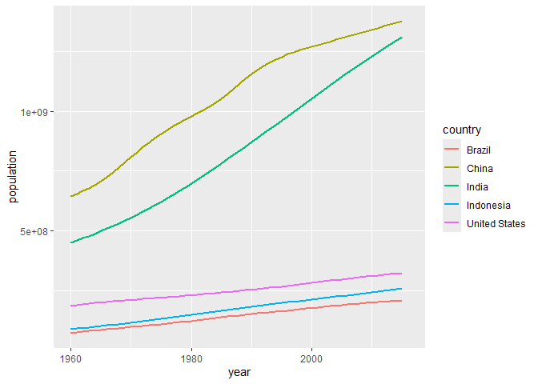
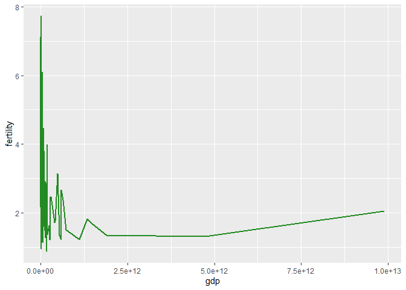
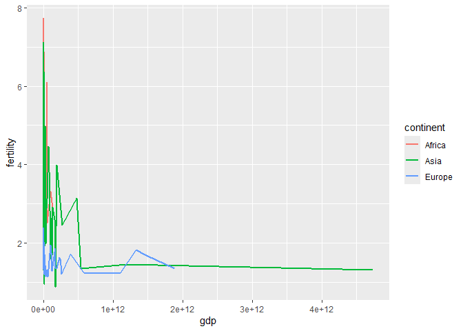
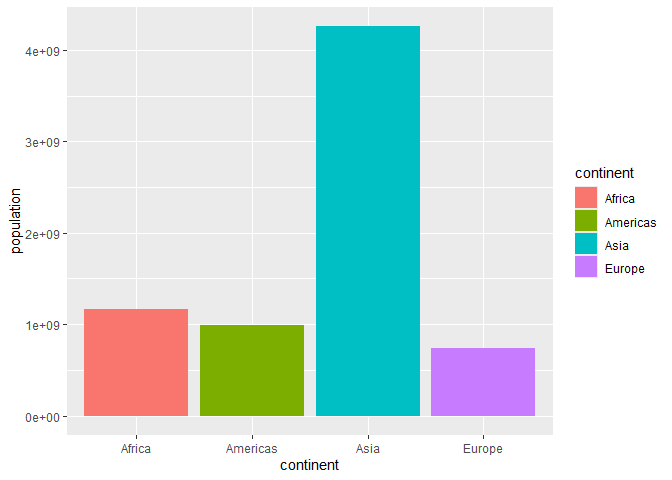

# Lab 4
Hannah Pryor

<br>

## Setup

``` r
# load packages
library(tidyverse)
library(dslabs)
```

<br>

<br>

## Look at gapminder data

See the first 5 lines of the dataset

    # A tibble: 5 × 9
      country    year infant_mortality life_expectancy fertility population      gdp
      <fct>     <int>            <dbl>           <dbl>     <dbl>      <dbl>    <dbl>
    1 Albania    1960            115.             62.9      6.19    1636054 NA      
    2 Algeria    1960            148.             47.5      7.65   11124892  1.38e10
    3 Angola     1960            208              36.0      7.32    5270844 NA      
    4 Antigua …  1960             NA              63.0      4.43      54681 NA      
    5 Argentina  1960             59.9            65.4      3.11   20619075  1.08e11
    # ℹ 2 more variables: continent <fct>, region <fct>

<br>

Read the column names in the dataset

    [1] "country"          "year"             "infant_mortality" "life_expectancy" 
    [5] "fertility"        "population"       "gdp"              "continent"       
    [9] "region"          

<br>

<br>

## Exercise 1

Which five countries had the largest population size in 2015 (the most
recent year for which population sizes are included in this dataset),
and how has the population sizes in those countries changes since 1960?

            country year population
    1         China 2015 1376048943
    2         India 2015 1311050527
    3 United States 2015  321773631
    4     Indonesia 2015  257563815
    5        Brazil 2015  207847528
    6      Pakistan 2015  188924874



<br>

Rank the following countries in infant mortality rate in 2015: Turkey,
Poland, South Korea, Russia, Vietnam, South Africa

           country year population infant_mortality
    1 South Africa 2015   54490406             33.6
    2      Vietnam 2015   93447601             17.3
    3       Turkey 2015   78665830             11.6
    4       Russia 2015  143456918              8.2
    5       Poland 2015   38611794              4.5
    6  South Korea 2015   50293439              2.9

<br>

What is the general relationship between per-capita GDP and fertility
rate?

- Negative relationship



<br>

If you break down the relationship between per-capita GDP and fertility
rate by continent, which continent (or regions) stands out as an
outlier?

- Europe — fertility stays about the same with increased gdp



<br>

There are roughly seven billion people in the world today. Which map
shows where people live? (Each figure represents 1 billion people)

- A is the most accurate representation



