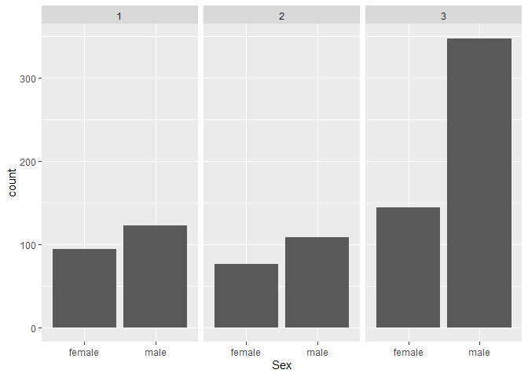
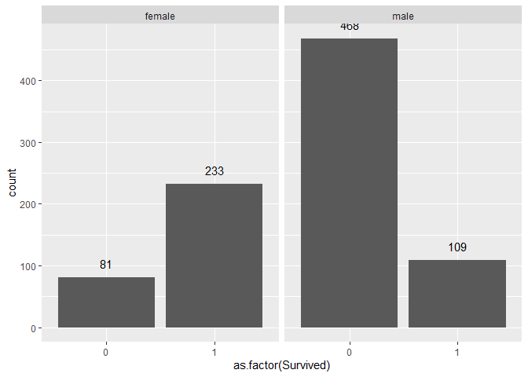

# lab5


### Load packages and read in data

``` r
# Load required packages
library(tidyverse)
library(knitr)

# Read in the data
titanic <- read_csv("https://raw.githubusercontent.com/nt246/NTRES-6100-data-science/master/datasets/Titanic.csv")
```

And take a look at the dataset…

| PassengerId | Survived | Pclass | Name | Sex | Age | SibSp | Parch | Ticket | Fare | Cabin | Embarked |
|---:|---:|---:|:---|:---|---:|---:|---:|:---|---:|:---|:---|
| 1 | 0 | 3 | Braund, Mr. Owen Harris | male | 22 | 1 | 0 | A/5 21171 | 7.2500 | NA | S |
| 2 | 1 | 1 | Cumings, Mrs. John Bradley (Florence Briggs Thayer) | female | 38 | 1 | 0 | PC 17599 | 71.2833 | C85 | C |
| 3 | 1 | 3 | Heikkinen, Miss. Laina | female | 26 | 0 | 0 | STON/O2. 3101282 | 7.9250 | NA | S |
| 4 | 1 | 1 | Futrelle, Mrs. Jacques Heath (Lily May Peel) | female | 35 | 1 | 0 | 113803 | 53.1000 | C123 | S |
| 5 | 0 | 3 | Allen, Mr. William Henry | male | 35 | 0 | 0 | 373450 | 8.0500 | NA | S |

``` r
View(titanic)
dim(titanic)
colnames(titanic)
```

<br>

<br>

## Exercise 1

<br>

### There were ~2224 people on board — how many do we have information for in this dataset?

``` r
titanic |> 
  dim()
```

We have data for 891 passengers

<br>

### How many survived and how many did not?

``` r
titanic |> 
  filter(Survived == 1) |> 
  dim() # 342 survivors

titanic |> 
  filter(Survived == 0) |> 
  dim() # 549 did not survive
```

Survivors: 342

Non-survivors: 549

<br>

### What is the overall survival rate?

``` r
survivors <- titanic |> 
  filter(Survived==1) |> 
  nrow()

total <- titanic |> 
  nrow()

survival_rate <- survivors/total
```

Survival rate is about 38.38%

<br>

<br>

### How many males and females?

``` r
titanic |> 
  filter(Sex=="female") |> 
  nrow() # 314 female passengers

titanic |> 
  filter(Sex=="male") |> 
  nrow() # 577 male passengers
```

Female: 314

Male: 577

<br>

### Break it down by ticket class?



More males than females in every class, but especially disproportionate
in the class 3 group

<br>

<br>

### How many passengers of each sex survived? How many did not? What is the survival rate for each sex?

    Warning: The dot-dot notation (`..count..`) was deprecated in ggplot2 3.4.0.
    ℹ Please use `after_stat(count)` instead.



Female: 233 survived, 81 did not

Male: 109 survived, 468 did not

<br>

``` r
male_survivors <- titanic |> 
  filter(Sex=="male") |> 
  filter(Survived==1) |> 
  nrow()

total_males <- titanic |> 
  filter(Sex=="male") |> 
  nrow()

male_survival_rate <- male_survivors/total_males # 18.89% survival
```

``` r
female_survivors <- titanic |> 
  filter(Sex=="female") |> 
  filter(Survived==1) |> 
  nrow()

total_females <- titanic |> 
  filter(Sex=="female") |> 
  nrow()

female_survival_rate <- female_survivors/total_females # 74.2% survival
```

Male survival rate is 18.89%

Female survival rate is 74.2%

<br>

<br>

### For how many passengers do we have age information (including estimated age)? For how many is the age information missing? What is the age distribution for passengers whose age information is available?

``` r
ppl_w_age_data <- titanic |> 
  filter(Age>0) |> 
  nrow()

total_ppl <- titanic |> 
  nrow()

ppl_wo_age_data <- total_ppl-ppl_w_age_data
```

We have age information for 714 passengers, and we do not have it for
177 passengers

<br>
