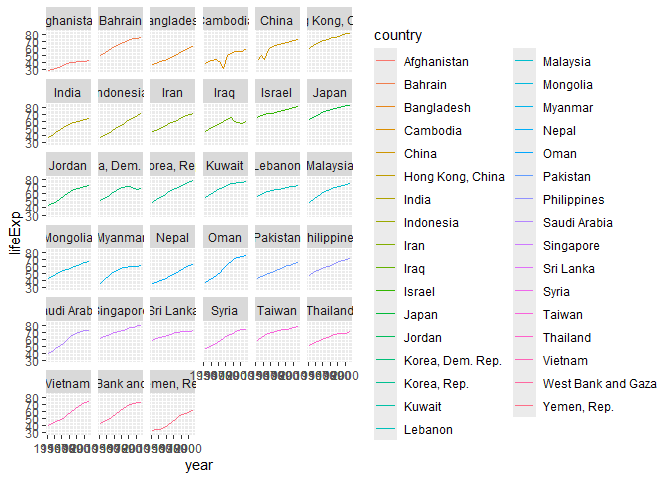

# assignment_5


<br>

<br>

First, load all the required packages with the following code. Install
them if they are not installed yet.

``` r
library(tidyverse)
library(knitr)
library(gapminder)
```

<br>

## Exercise 1. Trends in land value

This exercise uses a dataset that describes the trends in land value
(`Land.Value`), among other variables, in different states in the US
1975-2013. The states are grouped into four different regions, under the
variable `region`. This dataset was obtained from the Data Science
Services of Harvard University.

``` r
housing <- read_csv("https://raw.githubusercontent.com/nt246/NTRES-6100-data-science/master/datasets/landdata_states.csv")

housing |> 
  head() |> 
  kable()
```

| State | region | Date | Home.Value | Structure.Cost | Land.Value | Land.Share..Pct. | Home.Price.Index | Land.Price.Index | Year | Qrtr |
|:---|:---|---:|---:|---:|---:|---:|---:|---:|---:|---:|
| AK | West | 2010.25 | 224952 | 160599 | 64352 | 28.6 | 1.481 | 1.552 | 2010 | 1 |
| AK | West | 2010.50 | 225511 | 160252 | 65259 | 28.9 | 1.484 | 1.576 | 2010 | 2 |
| AK | West | 2009.75 | 225820 | 163791 | 62029 | 27.5 | 1.486 | 1.494 | 2009 | 3 |
| AK | West | 2010.00 | 224994 | 161787 | 63207 | 28.1 | 1.481 | 1.524 | 2009 | 4 |
| AK | West | 2008.00 | 234590 | 155400 | 79190 | 33.8 | 1.544 | 1.885 | 2007 | 4 |
| AK | West | 2008.25 | 233714 | 157458 | 76256 | 32.6 | 1.538 | 1.817 | 2008 | 1 |

<br>

#### 1.1 Washington DC was not assigned to a region in this dataset. According to the United States Census Bureau, however, DC is part of the South region. Here:

<br>

- Change the region of DC to “South” (Hint: there are multiple ways to
  do this, but `mutate()` and `ifelse()` might be helpful)

  ``` r
  housing2 <- housing |> 
    mutate(region = if_else(State=="DC", "South", region))
  ```

- Create a new tibble or regular dataframe consisting of this new
  updated `region` variable along with the original variables `State`,
  `Date`, and `Land.Value` (and no others)

  ``` r
  housing_reduced <-
    housing2 |> 
    select(region, State, Date, Land.Value)
  ```

- Pull out the records from DC in this new data frame. How many records
  are there from DC? Show the first 6 lines.

  ``` r
  # number of records from DC
  housing_reduced |> 
    count(State == "DC")
  ```

      # A tibble: 2 × 2
        `State == "DC"`     n
        <lgl>           <int>
      1 FALSE            7650
      2 TRUE              153

  ``` r
  # show first six rows
  housing_reduced |> 
    filter(State == "DC") |> 
    head(6) |> 
    kable()
  ```

  | region | State |    Date | Land.Value |
  |:-------|:------|--------:|-----------:|
  | South  | DC    | 2003.00 |     290522 |
  | South  | DC    | 2003.25 |     305673 |
  | South  | DC    | 2003.50 |     323078 |
  | South  | DC    | 2003.75 |     342010 |
  | South  | DC    | 2004.00 |     361999 |
  | South  | DC    | 2004.25 |     382792 |

There are 153 records from DC

<br>

#### 1.2 Generate a tibble/dataframe that summarizes the mean land value of each region at each time point and show its first 6 lines.

``` r
housing_mean_summary <-
  housing_reduced |> 
  group_by(region, Date) |> 
  summarize(mean_land_value=mean(Land.Value)) |> 
  arrange(region, Date) |> 
  head(6) |> 
  kable()

housing_mean_summary
```

| region  |    Date | mean_land_value |
|:--------|--------:|----------------:|
| Midwest | 1975.25 |        2452.167 |
| Midwest | 1975.50 |        2498.917 |
| Midwest | 1975.75 |        2608.167 |
| Midwest | 1976.00 |        2780.000 |
| Midwest | 1976.25 |        2967.333 |
| Midwest | 1976.50 |        3212.833 |

<br>

#### 1.3 Using the tibble/dataframe from 1.2, plot the trend in mean land value of each region through time.

``` r
housing_w_mean <-
  housing_reduced |> 
  group_by(region, Date) |> 
  summarize(mean_land_value=mean(Land.Value))

housing_w_mean |> 
  ggplot(aes(x=Date, y=mean_land_value))+
  geom_line(aes(color=region))
```


<br>

<br>

## Exercise 2. Life expectancy and GDP per capita 1952-2007

This exercise uses the `gapminder` dataset from the `gapminder` package.
It describes the life expectancy (`lifeExp`), GDP per capita
(`gdpPercap`), and population (`pop`) of 142 countries from 1952 to
2007. These countries can be grouped into 5 continents. As a reminder,
**reproduce the following plots exactly as shown.**

``` r
gapminder |> 
  head() |> 
  kable()
```

| country     | continent | year | lifeExp |      pop | gdpPercap |
|:------------|:----------|-----:|--------:|---------:|----------:|
| Afghanistan | Asia      | 1952 |  28.801 |  8425333 |  779.4453 |
| Afghanistan | Asia      | 1957 |  30.332 |  9240934 |  820.8530 |
| Afghanistan | Asia      | 1962 |  31.997 | 10267083 |  853.1007 |
| Afghanistan | Asia      | 1967 |  34.020 | 11537966 |  836.1971 |
| Afghanistan | Asia      | 1972 |  36.088 | 13079460 |  739.9811 |
| Afghanistan | Asia      | 1977 |  38.438 | 14880372 |  786.1134 |

<br>

#### 2.1 Use a scatterplot to explore the relationship between per capita GDP (`gdpPercap`) and life expectancy (`lifeExp`) in the year 2007.

``` r
gapminder |> 
  filter(year==2007) |> 
  ggplot(aes(x=gdpPercap, y=lifeExp)) +
  geom_point()
```


<br>

#### 2.2 Add a smoothing line to the previous plot.

``` r
gapminder |> 
  filter(year==2007) |> 
  ggplot(aes(x=gdpPercap, y=lifeExp)) +
  geom_point() +
  geom_smooth()
```


<br>

#### 2.3 Exclude Oceania from the previous plot, show each continent in a different color, and fit a separate smoothing line to each continent to identify differences in this relationship between continents. Turn off the confidence intervals.

Note: only two Oceanian countries are included in this dataset, and
`geom_smooth()` does not work with two data points, which is why they
are excluded.

``` r
gapminder |> 
  filter(year==2007) |> 
  filter(!(continent=="Oceania")) |> 
  ggplot(aes(x=gdpPercap, y=lifeExp)) +
  geom_point(aes(color=continent)) +
  geom_smooth(aes(color=continent), se=FALSE)
```


<br>

#### 2.4 Use faceting to solve the same problem. Include the confidence intervals in this plot.

``` r
gapminder |> 
  filter(year==2007) |> 
  filter(!(continent=="Oceania")) |> 
  ggplot(aes(x=gdpPercap, y=lifeExp)) +
  geom_point(aes(color=continent)) +
  geom_smooth(aes(color=continent)) +
  facet_wrap(~continent)
```


<br>

#### 2.5 Explore the trend in life expectancy through time in each continent. Color by continent.

``` r
gapminder |> 
  ggplot(aes(x=year, y=lifeExp)) +
  geom_line(aes(line=country, color=continent), lwd=0.5) +
  facet_wrap(~continent)
```


<br>

#### 2.6 From the previous plot, we see some abnormal trends in Asia and Africa, where the the life expectancy in some countries sharply dropped at certain time periods. Here, we look into what happened in Asia in more detail. First, create a new dataset by filtering only the Asian countries. Show the first 6 lines of this filtered dataset.

``` r
gapminder |> 
  filter(continent=="Asia") |> 
  head(6) |> 
  kable()
```

| country     | continent | year | lifeExp |      pop | gdpPercap |
|:------------|:----------|-----:|--------:|---------:|----------:|
| Afghanistan | Asia      | 1952 |  28.801 |  8425333 |  779.4453 |
| Afghanistan | Asia      | 1957 |  30.332 |  9240934 |  820.8530 |
| Afghanistan | Asia      | 1962 |  31.997 | 10267083 |  853.1007 |
| Afghanistan | Asia      | 1967 |  34.020 | 11537966 |  836.1971 |
| Afghanistan | Asia      | 1972 |  36.088 | 13079460 |  739.9811 |
| Afghanistan | Asia      | 1977 |  38.438 | 14880372 |  786.1134 |

<br>

#### 2.7 Using the filtered dataset, identify the countries that had abnormal trends in life expectancy by plotting, and discuss historical events possibly explaining these trends. (Hint: facet by country)

``` r
gapminder |> 
  filter(continent=="Asia") |> 
  ggplot(aes(x=year, y=lifeExp)) +
  geom_line(aes(color=country), lwd=0.5) +
  facet_wrap(~country)
```



It looks like Cambodia and China both have abnormal dips in life
expectancy, Cambodia around 1980 and China around 1965.

I Googled the history of these two countries around those time periods,
and it looks like the Cultural Revolution in China may be responsible
for the dip in life expectancy on that chart. For Cambodia, the
Cambodian-Vietnamese War appears to have taken place during that dip in
life expectancy, which is definitely a logical explanation for it.

Iraq seems to start falling more recently too, probably due to more
recent conflict in the middle east. This trend is less pronounced,
however.
